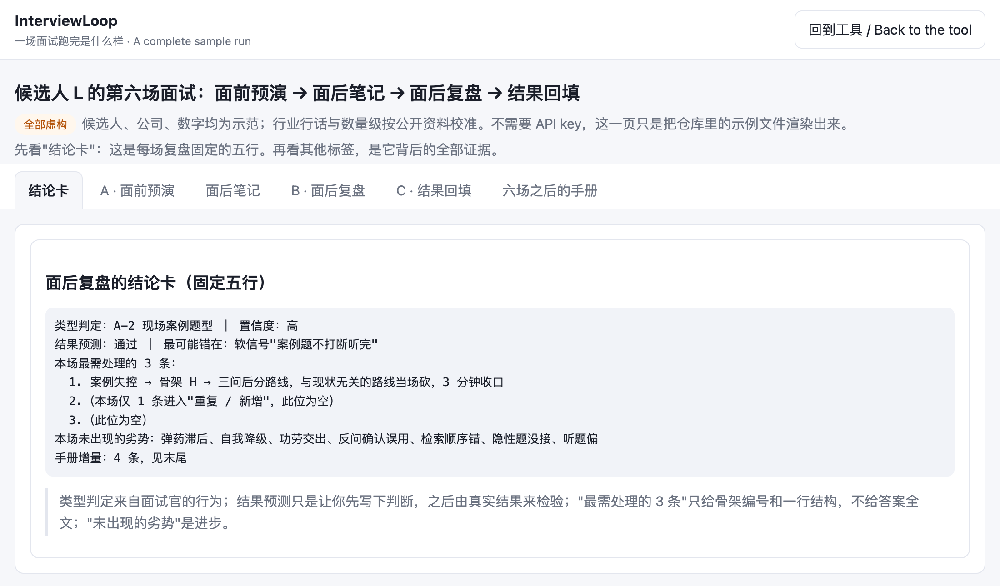

**[中文](#interviewloop--面试候选人自训练系统) ｜ [English](#interviewloop--self-training-system-for-interview-candidates)**

# InterviewLoop · 面试候选人自训练系统

> 中文是唯一主版本，英文由中文生成（协议 v0.4），两者不一致时以中文为准。

[](https://interviewloop-cn.github.io/interviewloop/web/demo.html)

作者：[Cintia.H](https://github.com/cintiahuang123-ai)

**三十秒看懂**：[看一场完整示例](https://interviewloop-cn.github.io/interviewloop/web/demo.html)（不用 key）｜[打开网页版](https://interviewloop-cn.github.io/interviewloop/web/)｜[零安装：单文件提示词](PROMPT.zh.md)（上传到 Kimi、DeepSeek、豆包就能跑）

## 这是什么

**InterviewLoop 用 AI 训练你，不是用 AI 面试你。** 它不替你答题，也不扮演面试官。它训练的是你的应答结构，和你对岗位、对行业的进一步认知，一场真实面试一场地练，让你和下一份工作更匹配。每一次面试都变成可积累的训练样本；样本是你的，不离开你的机器。

```
模块 A  面前预演
   → 面试 →
模块 B  面后复盘
   →
模块 C  结果回填
   → 手册长一行 →
模块 A  下一次
```

三步闭环。你的个人手册（劣势追踪表、校准记录、信号命中）跟着你一场一场长。每场面后，你先写下对这场的判断，再等真实结果来检验，判断错在哪写回手册。这一步不是为了算得准，是为了逼你先下判断、再对答案。工具不替你填只有你能填的东西：那些位置留空，打上 `【空位·思考漏洞】`。空位是训练点，不是功能缺失。

这一轮没过也没关系，样本在长。作者用自己三场真实面试试跑：同一个失分模式三场全中，凭感觉复盘时完全没发现；三场里工具的预测错了一场，错的那条也记进了校准记录。它的价值不在预测准，在强迫你做有结构的复盘。

## 用之前先看这三条

**这不是捷径。** 面试中实时提词的工具，和扮演面试官的 AI，都不会增加你自己的思考。这个工具逼你思考：JD 和简历都必须给，面后笔记要你自己写，空位要你自己填。想要一个替你答题的东西，这里不是。

**只对愿意对自己诚实的人有用。** 工具无法防止你给自己写有利的笔记。它的每一条判断只和你给它的笔记一样好，它记的每一个计数都是你自己填的。这是前提，不是漏洞。

**支持哪些文本。** 模块 A 吃 JD 全文和简历要点；模块 B 吃面后笔记（按模板填）和转录（可选，有转录才能用 `[原话]` 标签）；模块 C 吃一行结果。三个模块都可以附上你的个人手册。

**不经过任何服务器。** 手册、笔记、转录全部在你自己的机器或浏览器里。持久化靠 markdown 导出 / 导入。用网页版时，模型 API key 是你自己的，只存在浏览器里。

## 怎么用

产品本体是一份 markdown 协议。四种用法，从轻到重：

| 用法 | 要准备什么 | 适合谁 |
|---|---|---|
| [看示例](https://interviewloop-cn.github.io/interviewloop/web/demo.html) | 什么都不用 | 想先知道它输出什么 |
| [单文件提示词](PROMPT.zh.md) | 一个你常用的大模型聊天应用 | 不想装东西、没有 API key。把文件上传到 Kimi、DeepSeek、豆包、通义千问、智谱、ChatGPT 或 Claude，发一句"运行模块 A"加 JD 和简历 |
| [网页版](https://interviewloop-cn.github.io/interviewloop/web/) | 一个模型 API key | 想要本地保存手册、离线可用、导入导出 |
| Claude Code skill | Claude Code | 想要录音本地转录、自动生成笔记草稿、自动写回手册 |

**Claude Code skill（推荐）**

```
npx skills add interviewloop-cn/interviewloop
```
装好后在任意目录说"帮我准备这场面试"并给 JD，"复盘今天的面试"并给笔记、转录或录音，或者"走到第 2 轮"。skill 把手册放在 `~/InterviewLoop-workspace/handbook.md`，录音本地转录，从转录生成笔记草稿且每个计数都附原句出处，每次增量直接写回手册。

**任意模型，手动喂**

1. 把 `PROTOCOL.md` + `taxonomy/cn/` 五个文件 + 你的个人手册（如有）+ 本场输入，一起给模型。
2. 把模型输出的"手册增量"合并进你的 `handbook.md`。
3. 结果出来后跑模块 C。它写回一行；预测错了，再加一条校准记录。

三个模块的输入输出：

| 模块 | 你给 | 你得到 |
|---|---|---|
| A · 面前预演 | JD 和简历要点（都必填）、（手册） | 错位拦截、JD↔证据映射、面试官类型预判、5 分钟核对单、QA 预案（结构 + 一句结合简历的参考句）、带标记的自介半成品；可选追问链路预演，模型只追问不评分 |
| B · 面后复盘 | 面后笔记，或转录，或录音，或口述回忆（缺什么只问什么）、（手册）、（模块 A 输出） | 类型判定、链路对照与跨轮对照、失分模式追踪、先填信号表再预测、手册增量 |
| C · 结果回填 | 一行字：通过 / 未通过 / 走到第 N 轮 / 未知 | 写回一行，必要时一条校准记录 |

`SKILL.md` 是 Claude Code skill 的入口，只负责加载协议、管理本地工作区和写回手册，本身不含判断规则。

`web/` 下的网页是协议的一个客户端：选模型接口、填你自己的 API key（只存浏览器）、跑三个模块。首次加载后断网可用；它发出的唯一网络请求，是你主动触发的、发往你自己模型或语音接口的那一次。

### 网页版支持哪些模型

| 接口 | 在设置里怎么选 | Base URL |
|---|---|---|
| Claude | Anthropic | 内置 |
| DeepSeek | OpenAI 兼容接口 → 预设 DeepSeek | `https://api.deepseek.com/v1` |
| Kimi（月之暗面） | 预设 Kimi | `https://api.moonshot.cn/v1` |
| 通义千问（阿里云百炼） | 预设 通义千问 | `https://dashscope.aliyuncs.com/compatible-mode/v1` |
| 豆包（火山方舟） | 预设 豆包 | `https://ark.cn-beijing.volces.com/api/v3` |
| 智谱 GLM | 预设 智谱 | `https://open.bigmodel.cn/api/paas/v4` |
| OpenAI 及其他兼容接口 | 预设 OpenAI 或手填 | 自填 |

以上接口均允许浏览器直接调用（2026-09 逐个实测预检请求）。key 只存在你的浏览器里，请求从你的浏览器直达模型服务商。模型名更新很快，请到对应平台控制台复制当前可用的模型名。协议很长、规则很严，建议用各家当前最强的模型。

### 把网页安装成应用（PWA）三步

1. 用浏览器打开：`https://interviewloop-cn.github.io/interviewloop/web/`（Chrome / Edge / Safari 均可）。仓库根目录会自动跳转。
2. 选择**安装**（桌面端：地址栏的安装图标；iOS Safari：分享 → 添加到主屏幕；Android Chrome：菜单 → 安装应用）。
3. 从桌面或主屏幕打开。首次加载后断网可用。

## v1.0 边界

- **一位候选人，不分社招校招，面试官一人或多人。** 群面、无领导小组不覆盖：评分看组内相对表现，你给不出其他候选人的应答。校招特有的面试官类型需要持续录入样本，按贡献与反馈程度迭代。
- **只有一个市场包：`cn`。** 分类库源于中国互联网社招。英文文件是翻译加文化注释，不是独立市场包。海外市场包的启动条件：该市场累计 ≥10 场按贡献模板提交的记录。
- **分类库是种子不是全集。** 来自单一职能的小样本。"未分类"是合法输出，硬套不是。

## 仓库结构

```
PROTOCOL.md         主协议（中文，唯一主版本）
PROTOCOL.en.md      英文版，文件头标注对应的中文版本号
SKILL.md            Claude Code skill：工作区、路由、本地转录、手册写回
scripts/            transcribe.py（本地 whisper）、metrics.py（语速、填充词密度、最长单答）、check_quotes.py（[原话] 逐字核对）
GLOSSARY.md         zh↔en 术语表，全仓库翻译统一查表
taxonomy/cn/        面试官类型、骨架、信号、失分模式、业务阶段（market: cn）
taxonomy/en/        cn 的翻译，附 Cultural notes
templates/zh|en/    个人手册、面后笔记、贡献模板
example/            虚构候选人（骨科植入物临床市场），六场面试，一轮完整 A→B→C；SOURCES.md 列出行话与量级的公开校准来源
PROMPT.zh.md / PROMPT.en.md   零安装单文件提示词（由 scripts/build_prompt.py 生成）
web/                静态页 + PWA（index.html、demo.html 示例页、app.js、md.js、sw.js、manifest）
docs/               README 用图
index.html          跳转到 web/
LICENSE             CC BY-SA 4.0
ROADMAP.md
```

## 反馈

最想听到三类意见，按价值排序：

1. **方法论质疑**：你面过人，觉得某条判断不成立。[提一条质疑](https://github.com/interviewloop-cn/interviewloop/issues/new?template=method-challenge.yml)，最好带一个脱敏的反例。
2. **试用反馈**：你跑过一次，哪一步卡住，哪条输出是废话。[写试用反馈](https://github.com/interviewloop-cn/interviewloop/issues/new?template=trial-feedback.yml)。
3. **设计取舍**：比如"空位不让 AI 代填"值不值。去 [Discussions](https://github.com/interviewloop-cn/interviewloop/discussions) 聊。

反馈不需要写代码，也不需要装任何东西：[示例页](https://interviewloop-cn.github.io/interviewloop/web/demo.html)三十秒看完就能提。

## 贡献

只收 `taxonomy/` 的 PR，走 `templates/` 里的固定模板。禁公司名、人名、评价性语言。转录片段可以提交，但要去掉人名与公司名。模板字段本身就是脱敏边界。不承诺合并节奏。

## 关于本仓库的脱敏

仓库内不出现任何真实公司、人名、真实业务数字，包括作者自己的。所有样本均为虚构，行业与作者无关；行话与数量级按 `example/SOURCES.md` 里的公开资料校准。

---

# InterviewLoop · Self-Training System for Interview Candidates

[](https://interviewloop-cn.github.io/interviewloop/web/demo.html)

Author: [Cintia.H](https://github.com/cintiahuang123-ai)

**In thirty seconds**: [see a full sample run](https://interviewloop-cn.github.io/interviewloop/web/demo.html) (no key) ｜ [open the web app](https://interviewloop-cn.github.io/interviewloop/web/) ｜ [no install: the single-file prompt](PROMPT.en.md) (upload it to ChatGPT, Claude, DeepSeek or Kimi)

> **Chinese is the canonical version**; the English section is generated from it (source: zh section, protocol v0.4, glossary v1). Where they differ, the Chinese text wins. All English terms follow `GLOSSARY.md`.

## What this is

**InterviewLoop uses AI to train you, not to interview you.** It does not answer for you and does not play the interviewer. It trains the structure of your answers and your understanding of the role and the industry, one real interview at a time, so that you and your next job fit better. Every interview becomes a training sample you can accumulate; the sample belongs to you and never leaves your machine.

```
Module A  Pre-interview rehearsal
   → the interview →
Module B  Post-interview review
   →
Module C  Outcome backfill
   → your handbook grows one row →
Module A  next interview
```

Three steps close a loop. Your personal handbook (weakness tracker, calibration records, signal hit log) grows one interview at a time. After each interview you write down your judgement before the result arrives, then check it; where the judgement was wrong goes back into your handbook. The point is not to forecast accurately but to make you commit and then check. The tool never fills in what only you can know: those places are left blank and marked `【空位·思考漏洞】` (Blank · Thinking Gap). A blank is a training point, not a missing feature.

Even if this round fails, the sample grows. In the author's own trial on three real interviews, one pitfall appeared in all three and had gone unnoticed in gut-feel review; the tool's prediction was wrong in one of the three, and that miss went into the calibration record too. Its value is not accurate prediction; it is forcing a structured review.

## Read this before you use it

**It is not a shortcut.** Tools that answer for you in real time, or an AI that plays interviewer, add nothing to your own thinking. This one makes you do the thinking: the JD and your résumé are both required, the post-interview notes are yours to write, and the blanks are yours to fill. If you want something that answers for you, this is the wrong tool.

**It only works for people willing to be honest with themselves.** The tool cannot stop you from writing notes that flatter you. Every judgement it makes is only as good as the notes you give it, and every count it keeps is a count you filled in. This is a precondition, not a loophole.

**What text it takes.** Module A takes the JD and your résumé points; Module B takes post-interview notes (on the template) and, optionally, a transcript (the `[VERBATIM]` tag is only available with one); Module C takes a one-line result. All three can carry your personal handbook.

**Nothing goes through a server.** Your handbook, notes and transcripts stay on your machine or in your browser. Persistence is markdown export and import. If you use the web page, you bring your own model API key, and the key is stored only in your browser.

## How to use it

The product is a markdown protocol. Four ways to use it, lightest first:

| Way | What you need | For whom |
|---|---|---|
| [See the sample](https://interviewloop-cn.github.io/interviewloop/web/demo.html) | nothing | you want to know what it outputs |
| [Single-file prompt](PROMPT.en.md) | a chat app you already use | no install, no API key: upload the file to ChatGPT, Claude, DeepSeek, Kimi… and say "Run Module A" with the JD and your résumé |
| [Web app](https://interviewloop-cn.github.io/interviewloop/web/) | one model API key | local handbook storage, offline, import and export. Works with Claude and any OpenAI-compatible endpoint: DeepSeek, Kimi, Qwen, Doubao, GLM and OpenAI all allow direct browser calls (verified 2026-09) |
| Claude Code skill | Claude Code | local transcription of recordings, notes drafted from the transcript, automatic handbook write-back |

**Claude Code skill (recommended)**

```
npx skills add interviewloop-cn/interviewloop
```
Then, in any directory, say "prepare me for this interview" with the JD, "debrief today's interview" with your notes, transcript or recording, or "reached round 2". The skill keeps your handbook at `~/InterviewLoop-workspace/handbook.md`, transcribes recordings locally, drafts your notes from the transcript with every count sourced to a verbatim line, and writes each increment back to the handbook.

**Any model, by hand**

1. Give the model `PROTOCOL.md` + the five files in `taxonomy/cn/` + your handbook (if you have one) + this interview's input.
2. Copy the increment the model outputs into your `handbook.md`.
3. After the outcome is known, run Module C. It writes back one row and, if the prediction was wrong, one calibration record.

Three module inputs:

| Module | You provide | You get |
|---|---|---|
| A · Pre-interview Rehearsal | JD and résumé points (both required), (handbook) | mismatch intercept, JD ↔ evidence map, type forecast, 5-minute pre-interview checklist, QA plan (structure plus one reference sentence built from your résumé), a three-tag self-intro draft; optional follow-up chain rehearsal where the model only asks |
| B · Post-interview Review | post-interview notes, or a transcript, or a recording, or spoken recall (the tool asks only for what is missing), (handbook), (Module A output) | type judgement, follow-up chain and cross-round comparison, pitfall tracking, signal table → outcome prediction, handbook increment |
| C · Outcome Backfill | one line: pass / fail / reached round N / unknown | one row written back, calibration record if needed |

`SKILL.md` is the entry point of the Claude Code skill: it loads the protocol, manages your local workspace and writes increments back to the handbook. It contains no judgement rules of its own.

The web page under `web/` is one client of the protocol: pick a model endpoint, paste your own API key (stored only in your browser), and run the three modules. It works offline after the first load; the only network requests it ever makes are the ones you trigger to your own model or speech endpoint.

### Install the web page as an app (PWA)

1. Open the page in a browser: `https://interviewloop-cn.github.io/interviewloop/web/` (Chrome, Edge or Safari). The repository root redirects there.
2. Choose **Install** (desktop: the icon in the address bar; iOS Safari: Share → Add to Home Screen; Android Chrome: menu → Install app).
3. Open it from your desktop or home screen. After the first load it works offline.

## Scope of v1.0

- **One candidate, experienced hire or campus, with one or more interviewers.** Group interviews and leaderless discussions are not covered: their scoring rests on relative performance and you cannot supply the other candidates' answers. Campus-specific interviewer types need continued sample intake and iterate with contributions and feedback.
- **One market package: `cn`.** The taxonomy was written from interviews in the Chinese internet industry. English files are translations with cultural notes, not a separate market package. An overseas package starts only after that market has ≥10 interview records submitted through the contribution template.
- **The taxonomy is a seed, not a census.** It came from a small sample in one job function. "Unclassified" is a valid output; forcing a match is not.

## Repository layout

```
PROTOCOL.md         main protocol (Chinese, canonical)
PROTOCOL.en.md      English translation, header cites the Chinese version
SKILL.md            Claude Code skill: workspace, routing, local transcription, handbook write-back
scripts/            transcribe.py (local whisper), metrics.py (speaking rate, filler density, longest answer), check_quotes.py (verbatim-quote check)
GLOSSARY.md         zh↔en term table; all translation goes through it
taxonomy/cn/        interviewer types, skeletons, signals, pitfalls, stages (market: cn)
taxonomy/en/        translation of cn/ with cultural notes
templates/zh|en/    handbook, post-interview notes, contribution templates
example/            a fictional candidate (orthopaedic-implant clinical marketing), six interviews, one full A→B→C run; SOURCES.md lists the public data the jargon and magnitudes are calibrated against
PROMPT.zh.md / PROMPT.en.md   no-install single-file prompt (generated by scripts/build_prompt.py)
web/                static page + PWA (index.html, demo.html sample page, app.js, md.js, sw.js, manifest)
docs/               images for the README
index.html          redirects to web/
LICENSE             CC BY-SA 4.0
ROADMAP.md
```

## Feedback

Three kinds of input are wanted most, in order of value:

1. **Challenge the method**: you have interviewed people and think a rule does not hold. [Open a challenge](https://github.com/interviewloop-cn/interviewloop/issues/new?template=method-challenge.yml), ideally with an anonymised counter-example.
2. **Trial feedback**: you ran it once; where did you stall, which output was noise. [Write trial feedback](https://github.com/interviewloop-cn/interviewloop/issues/new?template=trial-feedback.yml).
3. **Design trade-offs**: for example, whether refusing to let the AI fill the blanks is worth it. Talk in [Discussions](https://github.com/interviewloop-cn/interviewloop/discussions).

Feedback needs no code and no install: the [sample run](https://interviewloop-cn.github.io/interviewloop/web/demo.html) takes thirty seconds.

## Contributing

Only `taxonomy/` accepts pull requests, through the fixed templates in `templates/`. No company names, no personal names, no evaluative language. Transcript excerpts are accepted once names and company names are removed. The template fields are the anonymisation boundary. There is no promised merge cadence.

## Privacy note on this repository

No real company, person or business figure appears anywhere in this repository, including the author's own. Every example is fictional, in an industry the author has never worked in; its jargon and orders of magnitude are calibrated against public sources listed in `example/SOURCES.md`.
